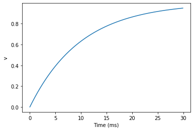
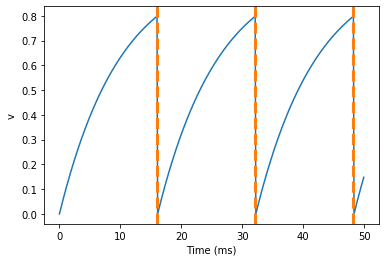
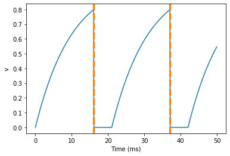
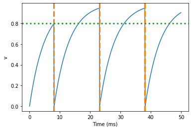
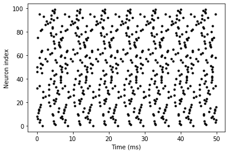
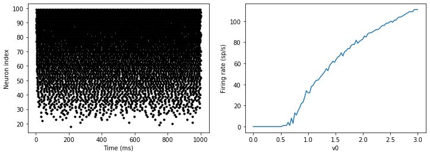
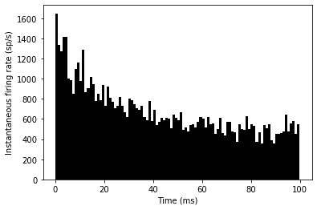

Introduction to Brian part 1: Neurons
=====================================

.. |launchbinder| image:: http://mybinder.org/badge.svg
.. _launchbinder: http://mybinder.org:/repo/brian-team/brian2-binder/notebooks/tutorials/1-intro-to-brian-neurons.ipynb

.. note::
   This tutorial is a static non-editable version. You can launch an
   interactive, editable version without installing any local files
   using the Binder service (although note that at some times this
   may be slow or fail to open): |launchbinder|_

   Alternatively, you can download a copy of the notebook file
   to use locally: :download:`1-intro-to-brian-neurons.ipynb`

   See the :doc:`tutorial overview page <index>` for more details.

All Brian scripts start with the following. If you're trying this
notebook out in the Jupyter notebook, you should start by running this
cell.

.. code:: python

    from brian2 import *

Later we'll do some plotting in the notebook, so we activate inline
plotting in the notebook by doing this:

.. code:: python

    %matplotlib inline

If you are not using the Jupyter notebook to run this example (e.g. you
are using a standard Python terminal, or you copy&paste these example
into an editor and run them as a script), then plots will not
automatically be displayed. In this case, call the ``show()`` command
explicitly after the plotting commands.

Units system
------------

Brian has a system for using quantities with physical dimensions:

.. code:: python

    20*volt

.. math::

    20.0\,\mathrm{V}

All of the basic SI units can be used (volt, amp, etc.) along with all
the standard prefixes (m=milli, p=pico, etc.), as well as a few special
abbreviations like ``mV`` for millivolt, ``pF`` for picofarad, etc.

.. code:: python

    1000*amp

.. math::

    1.0\,\mathrm{k}\,\mathrm{A}

.. code:: python

    1e6*volt

.. math::

    1.0\,\mathrm{M}\,\mathrm{V}

.. code:: python

    1000*namp

.. math::

    1.0\,\mathrm{\mu}\,\mathrm{A}

Also note that combinations of units with work as expected:

.. code:: python

    10*nA*5*Mohm

.. math::

    50.0\,\mathrm{m}\,\mathrm{V}

And if you try to do something wrong like adding amps and volts, what
happens?

.. code:: python

    5*amp+10*volt

::

    

    DimensionMismatchErrorTraceback (most recent call last)

    <ipython-input-8-ad1fc5691a4b> in <module>()
    ----> 1 5*amp+10*volt
    

    /home/marcel/programming/brian2/brian2/units/fundamentalunits.pyc in __add__(self, other)
       1415         return self._binary_operation(other, operator.add,
       1416                                       fail_for_mismatch=True,
    -> 1417                                       operator_str='+')
       1418 
       1419     def __radd__(self, other):

    /home/marcel/programming/brian2/brian2/units/fundamentalunits.pyc in _binary_operation(self, other, operation, dim_operation, fail_for_mismatch, operator_str, inplace)
       1355                 _, other_dim = fail_for_dimension_mismatch(self, other, message,
       1356                                                            value1=self,
    -> 1357                                                            value2=other)
       1358 
       1359         if other_dim is None:

    /home/marcel/programming/brian2/brian2/units/fundamentalunits.pyc in fail_for_dimension_mismatch(obj1, obj2, error_message, **error_quantities)
        182             raise DimensionMismatchError(error_message, dim1)
        183         else:
    --> 184             raise DimensionMismatchError(error_message, dim1, dim2)
        185     else:
        186         return dim1, dim2

    DimensionMismatchError: Cannot calculate 5. A + 10. V, units do not match (units are amp and volt).

If you haven't see an error message in Python before that can look a bit
overwhelming, but it's actually quite simple and it's important to know
how to read these because you'll probably see them quite often.

You should start at the bottom and work up. The last line gives the
error type ``DimensionMismatchError`` along with a more specific message
(in this case, you were trying to add together two quantities with
different SI units, which is impossible).

Working upwards, each of the sections starts with a filename (e.g.
``C:\Users\Dan\...``) with possibly the name of a function, and then a
few lines surrounding the line where the error occurred (which is
identified with an arrow).

The last of these sections shows the place in the function where the
error actually happened. The section above it shows the function that
called that function, and so on until the first section will be the
script that you actually run. This sequence of sections is called a
traceback, and is helpful in debugging.

If you see a traceback, what you want to do is start at the bottom and
scan up the sections until you find your own file because that's most
likely where the problem is. (Of course, your code might be correct and
Brian may have a bug in which case, please let us know on the email
support list.)

A simple model
--------------

Let's start by defining a simple neuron model. In Brian, all models are
defined by systems of differential equations. Here's a simple example of
what that looks like:

.. code:: python

    tau = 10*ms
    eqs = '''
    dv/dt = (1-v)/tau : 1
    '''

In Python, the notation ``'''`` is used to begin and end a multi-line
string. So the equations are just a string with one line per equation.
The equations are formatted with standard mathematical notation, with
one addition. At the end of a line you write ``: unit`` where ``unit``
is the SI unit of that variable. Note that this is not the unit of the
two sides of the equation (which would be ``1/second``), but the unit of
the *variable* defined by the equation, i.e. in this case :math:`v`.

Now let's use this definition to create a neuron.

.. code:: python

    G = NeuronGroup(1, eqs)

In Brian, you only create groups of neurons, using the class
``NeuronGroup``. The first two arguments when you create one of these
objects are the number of neurons (in this case, 1) and the defining
differential equations.

Let's see what happens if we didn't put the variable ``tau`` in the
equation:

.. code:: python

    eqs = '''
    dv/dt = 1-v : 1
    '''
    G = NeuronGroup(1, eqs)
    run(100*ms)

::

    

    BrianObjectExceptionTraceback (most recent call last)

    <ipython-input-11-d086eea0b2de> in <module>()
          3 '''
          4 G = NeuronGroup(1, eqs)
    ----> 5 run(100*ms)
    

    /home/marcel/programming/brian2/brian2/units/fundamentalunits.pyc in new_f(*args, **kwds)
       2410                         raise DimensionMismatchError(error_message,
       2411                                                      newkeyset[k])
    -> 2412             result = f(*args, **kwds)
       2413             if 'result' in au:
       2414                 if au['result'] == bool:

    /home/marcel/programming/brian2/brian2/core/magic.pyc in run(duration, report, report_period, namespace, profile, level)
        369     '''
        370     return magic_network.run(duration, report=report, report_period=report_period,
    --> 371                              namespace=namespace, profile=profile, level=2+level)
        372 run.__module__ = __name__
        373 

    /home/marcel/programming/brian2/brian2/core/magic.pyc in run(self, duration, report, report_period, namespace, profile, level)
        229         self._update_magic_objects(level=level+1)
        230         Network.run(self, duration, report=report, report_period=report_period,
    --> 231                     namespace=namespace, profile=profile, level=level+1)
        232 
        233     def store(self, name='default', filename=None, level=0):

    /home/marcel/programming/brian2/brian2/core/base.pyc in device_override_decorated_function(*args, **kwds)
        276                 return getattr(curdev, name)(*args, **kwds)
        277             else:
    --> 278                 return func(*args, **kwds)
        279 
        280         device_override_decorated_function.__doc__ = func.__doc__

    /home/marcel/programming/brian2/brian2/units/fundamentalunits.pyc in new_f(*args, **kwds)
       2410                         raise DimensionMismatchError(error_message,
       2411                                                      newkeyset[k])
    -> 2412             result = f(*args, **kwds)
       2413             if 'result' in au:
       2414                 if au['result'] == bool:

    /home/marcel/programming/brian2/brian2/core/network.pyc in run(self, duration, report, report_period, namespace, profile, level)
        787             namespace = get_local_namespace(level=level+3)
        788 
    --> 789         self.before_run(namespace)
        790 
        791         if len(self.objects)==0:

    /home/marcel/programming/brian2/brian2/core/base.pyc in device_override_decorated_function(*args, **kwds)
        276                 return getattr(curdev, name)(*args, **kwds)
        277             else:
    --> 278                 return func(*args, **kwds)
        279 
        280         device_override_decorated_function.__doc__ = func.__doc__

    /home/marcel/programming/brian2/brian2/core/network.pyc in before_run(self, run_namespace)
        687                     obj.before_run(run_namespace)
        688                 except Exception as ex:
    --> 689                     raise brian_object_exception("An error occurred when preparing an object.", obj, ex)
        690 
        691         # Check that no object has been run as part of another network before

    BrianObjectException: Original error and traceback:
    Traceback (most recent call last):
      File "/home/marcel/programming/brian2/brian2/core/network.py", line 687, in before_run
        obj.before_run(run_namespace)
      File "/home/marcel/programming/brian2/brian2/groups/neurongroup.py", line 778, in before_run
        self.equations.check_units(self, run_namespace=run_namespace)
      File "/home/marcel/programming/brian2/brian2/equations/equations.py", line 867, in check_units
        *ex.dims)
    DimensionMismatchError: Inconsistent units in differential equation defining variable v:
    Expression 1-v does not have the expected unit hertz (unit is 1).
    
    Error encountered with object named "neurongroup_1".
    Object was created here (most recent call only, full details in debug log):
      File "<ipython-input-11-d086eea0b2de>", line 4, in <module>
        G = NeuronGroup(1, eqs)
    
    An error occurred when preparing an object. DimensionMismatchError: Inconsistent units in differential equation defining variable v:
    Expression 1-v does not have the expected unit hertz (unit is 1).
    (See above for original error message and traceback.)

An error is raised, but why? The reason is that the differential
equation is now dimensionally inconsistent. The left hand side ``dv/dt``
has units of ``1/second`` but the right hand side ``1-v`` is
dimensionless. People often find this behaviour of Brian confusing
because this sort of equation is very common in mathematics. However,
for quantities with physical dimensions it is incorrect because the
results would change depending on the unit you measured it in. For time,
if you measured it in seconds the same equation would behave differently
to how it would if you measured time in milliseconds. To avoid this, we
insist that you always specify dimensionally consistent equations.

Now let's go back to the good equations and actually run the simulation.

.. code:: python

    start_scope()
    
    tau = 10*ms
    eqs = '''
    dv/dt = (1-v)/tau : 1
    '''
    
    G = NeuronGroup(1, eqs)
    run(100*ms)

.. parsed-literal::

    INFO       No numerical integration method specified for group 'neurongroup', using method 'linear' (took 0.07s). [brian2.stateupdaters.base.method_choice]

First off, ignore that ``start_scope()`` at the top of the cell. You'll
see that in each cell in this tutorial where we run a simulation. All it
does is make sure that any Brian objects created before the function is
called aren't included in the next run of the simulation.

Secondly, you'll see that there is an "INFO" message about not
specifying the numerical integration method. This is harmless and just
to let you know what method we chose, but we'll fix it in the next cell
by specifying the method explicitly.

So, what has happened here? Well, the command ``run(100*ms)`` runs the
simulation for 100 ms. We can see that this has worked by printing the
value of the variable ``v`` before and after the simulation.

.. code:: python

    start_scope()
    
    G = NeuronGroup(1, eqs, method='linear')
    print('Before v = %s' % G.v[0])
    run(100*ms)
    print('After v = %s' % G.v[0])

.. parsed-literal::

    Before v = 0.0
    After v = 0.99995460007

By default, all variables start with the value 0. Since the differential
equation is ``dv/dt=(1-v)/tau`` we would expect after a while that ``v``
would tend towards the value 1, which is just what we see. Specifically,
we'd expect ``v`` to have the value ``1-exp(-t/tau)``. Let's see if
that's right.

.. code:: python

    print('Expected value of v = %s' % (1-exp(-100*ms/tau)))

.. parsed-literal::

    Expected value of v = 0.99995460007

Good news, the simulation gives the value we'd expect!

Now let's take a look at a graph of how the variable ``v`` evolves over
time.

.. code:: python

    start_scope()
    
    G = NeuronGroup(1, eqs, method='linear')
    M = StateMonitor(G, 'v', record=True)
    
    run(30*ms)
    
    plot(M.t/ms, M.v[0])
    xlabel('Time (ms)')
    ylabel('v');

This time we only ran the simulation for 30 ms so that we can see the
behaviour better. It looks like it's behaving as expected, but let's
just check that analytically by plotting the expected behaviour on top.

.. code:: python

    start_scope()
    
    G = NeuronGroup(1, eqs, method='linear')
    M = StateMonitor(G, 'v', record=0)
    
    run(30*ms)
    
    plot(M.t/ms, M.v[0], 'b', label='Brian')
    plot(M.t/ms, 1-exp(-M.t/tau), 'r--',label='Analytic')
    xlabel('Time (ms)')
    ylabel('v')
    legend();

.. image:: 1-intro-to-brian-neurons_image_33_0.png

As you can see, the blue (Brian) and dashed red (analytic solution)
lines coincide.

In this example, we used the object ``StateMonitor`` object. This is
used to record the values of a neuron variable while the simulation
runs. The first two arguments are the group to record from, and the
variable you want to record from. We also specify ``record=0``. This
means that we record all values for neuron 0. We have to specify which
neurons we want to record because in large simulations with many neurons
it usually uses up too much RAM to record the values of all neurons.

Now try modifying the equations and parameters and see what happens in
the cell below.

.. code:: python

    start_scope()
    
    tau = 10*ms
    eqs = '''
    dv/dt = (sin(2*pi*100*Hz*t)-v)/tau : 1
    '''
    
    # Change to Euler method because exact integrator doesn't work here
    G = NeuronGroup(1, eqs, method='euler')
    M = StateMonitor(G, 'v', record=0)
    
    G.v = 5 # initial value
    
    run(60*ms)
    
    plot(M.t/ms, M.v[0])
    xlabel('Time (ms)')
    ylabel('v');

Adding spikes
-------------

So far we haven't done anything neuronal, just played around with
differential equations. Now let's start adding spiking behaviour.

.. code:: python

    start_scope()
    
    tau = 10*ms
    eqs = '''
    dv/dt = (1-v)/tau : 1
    '''
    
    G = NeuronGroup(1, eqs, threshold='v>0.8', reset='v = 0', method='linear')
    
    M = StateMonitor(G, 'v', record=0)
    run(50*ms)
    plot(M.t/ms, M.v[0])
    xlabel('Time (ms)')
    ylabel('v');

We've added two new keywords to the ``NeuronGroup`` declaration:
``threshold='v>0.8'`` and ``reset='v = 0'``. What this means is that
when ``v>0.8`` we fire a spike, and immediately reset ``v = 0`` after
the spike. We can put any expression and series of statements as these
strings.

As you can see, at the beginning the behaviour is the same as before
until ``v`` crosses the threshold ``v>0.8`` at which point you see it
reset to 0. You can't see it in this figure, but internally Brian has
registered this event as a spike. Let's have a look at that.

.. code:: python

    start_scope()
    
    G = NeuronGroup(1, eqs, threshold='v>0.8', reset='v = 0', method='linear')
    
    spikemon = SpikeMonitor(G)
    
    run(50*ms)
    
    print('Spike times: %s' % spikemon.t[:])

.. parsed-literal::

    Spike times: [ 16.   32.1  48.2] ms

The ``SpikeMonitor`` object takes the group whose spikes you want to
record as its argument and stores the spike times in the variable ``t``.
Let's plot those spikes on top of the other figure to see that it's
getting it right.

.. code:: python

    start_scope()
    
    G = NeuronGroup(1, eqs, threshold='v>0.8', reset='v = 0', method='linear')
    
    statemon = StateMonitor(G, 'v', record=0)
    spikemon = SpikeMonitor(G)
    
    run(50*ms)
    
    plot(statemon.t/ms, statemon.v[0])
    for t in spikemon.t:
        axvline(t/ms, ls='--', c='r', lw=3)
    xlabel('Time (ms)')
    ylabel('v');

Here we've used the ``axvline`` command from ``matplotlib`` to draw a
red, dashed vertical line at the time of each spike recorded by the
``SpikeMonitor``.

Now try changing the strings for ``threshold`` and ``reset`` in the cell
above to see what happens.

Refractoriness
--------------

A common feature of neuron models is refractoriness. This means that
after the neuron fires a spike it becomes refractory for a certain
duration and cannot fire another spike until this period is over. Here's
how we do that in Brian.

.. code:: python

    start_scope()
    
    tau = 10*ms
    eqs = '''
    dv/dt = (1-v)/tau : 1 (unless refractory)
    '''
    
    G = NeuronGroup(1, eqs, threshold='v>0.8', reset='v = 0', refractory=5*ms, method='linear')
    
    statemon = StateMonitor(G, 'v', record=0)
    spikemon = SpikeMonitor(G)
    
    run(50*ms)
    
    plot(statemon.t/ms, statemon.v[0])
    for t in spikemon.t:
        axvline(t/ms, ls='--', c='r', lw=3)
    xlabel('Time (ms)')
    ylabel('v');

As you can see in this figure, after the first spike, ``v`` stays at 0
for around 5 ms before it resumes its normal behaviour. To do this,
we've done two things. Firstly, we've added the keyword
``refractory=5*ms`` to the ``NeuronGroup`` declaration. On its own, this
only means that the neuron cannot spike in this period (see below), but
doesn't change how ``v`` behaves. In order to make ``v`` stay constant
during the refractory period, we have to add ``(unless refractory)`` to
the end of the definition of ``v`` in the differential equations. What
this means is that the differential equation determines the behaviour of
``v`` unless it's refractory in which case it is switched off.

Here's what would happen if we didn't include ``(unless refractory)``.
Note that we've also decreased the value of ``tau`` and increased the
length of the refractory period to make the behaviour clearer.

.. code:: python

    start_scope()
    
    tau = 5*ms
    eqs = '''
    dv/dt = (1-v)/tau : 1
    '''
    
    G = NeuronGroup(1, eqs, threshold='v>0.8', reset='v = 0', refractory=15*ms, method='linear')
    
    statemon = StateMonitor(G, 'v', record=0)
    spikemon = SpikeMonitor(G)
    
    run(50*ms)
    
    plot(statemon.t/ms, statemon.v[0])
    for t in spikemon.t:
        axvline(t/ms, ls='--', c='r', lw=3)
    axhline(0.8, ls=':', c='g', lw=3)
    xlabel('Time (ms)')
    ylabel('v')
    print("Spike times: %s" % spikemon.t[:])

.. parsed-literal::

    Spike times: [  8.   23.1  38.2] ms

So what's going on here? The behaviour for the first spike is the same:
``v`` rises to 0.8 and then the neuron fires a spike at time 8 ms before
immediately resetting to 0. Since the refractory period is now 15 ms
this means that the neuron won't be able to spike again until time 8 +
15 = 23 ms. Immediately after the first spike, the value of ``v`` now
instantly starts to rise because we didn't specify
``(unless refractory)`` in the definition of ``dv/dt``. However, once it
reaches the value 0.8 (the dashed green line) at time roughly 8 ms it
doesn't fire a spike even though the threshold is ``v>0.8``. This is
because the neuron is still refractory until time 23 ms, at which point
it fires a spike.

Note that you can do more complicated and interesting things with
refractoriness. See the full documentation for more details about how it
works.

Multiple neurons
----------------

So far we've only been working with a single neuron. Let's do something
interesting with multiple neurons.

.. code:: python

    start_scope()
    
    N = 100
    tau = 10*ms
    eqs = '''
    dv/dt = (2-v)/tau : 1
    '''
    
    G = NeuronGroup(N, eqs, threshold='v>1', reset='v=0', method='linear')
    G.v = 'rand()'
    
    spikemon = SpikeMonitor(G)
    
    run(50*ms)
    
    plot(spikemon.t/ms, spikemon.i, '.k')
    xlabel('Time (ms)')
    ylabel('Neuron index');

This shows a few changes. Firstly, we've got a new variable ``N``
determining the number of neurons. Secondly, we added the statement
``G.v = 'rand()'`` before the run. What this does is initialise each
neuron with a different uniform random value between 0 and 1. We've done
this just so each neuron will do something a bit different. The other
big change is how we plot the data in the end.

As well as the variable ``spikemon.t`` with the times of all the spikes,
we've also used the variable ``spikemon.i`` which gives the
corresponding neuron index for each spike, and plotted a single black
dot with time on the x-axis and neuron index on the y-value. This is the
standard "raster plot" used in neuroscience.

Parameters
----------

To make these multiple neurons do something more interesting, let's
introduce per-neuron parameters that don't have a differential equation
attached to them.

.. code:: python

    start_scope()
    
    N = 100
    tau = 10*ms
    v0_max = 3.
    duration = 1000*ms
    
    eqs = '''
    dv/dt = (v0-v)/tau : 1 (unless refractory)
    v0 : 1
    '''
    
    G = NeuronGroup(N, eqs, threshold='v>1', reset='v=0', refractory=5*ms, method='linear')
    M = SpikeMonitor(G)
    
    G.v0 = 'i*v0_max/(N-1)'
    
    run(duration)
    
    figure(figsize=(12,4))
    subplot(121)
    plot(M.t/ms, M.i, '.k')
    xlabel('Time (ms)')
    ylabel('Neuron index')
    subplot(122)
    plot(G.v0, M.count/duration)
    xlabel('v0')
    ylabel('Firing rate (sp/s)');

The line ``v0 : 1`` declares a new per-neuron parameter ``v0`` with
units ``1`` (i.e. dimensionless).

The line ``G.v0 = 'i*v0_max/(N-1)'`` initialises the value of v0 for
each neuron varying from 0 up to ``v0_max``. The symbol ``i`` when it
appears in strings like this refers to the neuron index.

So in this example, we're driving the neuron towards the value ``v0``
exponentially, but when ``v`` crosses ``v>1``, it fires a spike and
resets. The effect is that the rate at which it fires spikes will be
related to the value of ``v0``. For ``v0<1`` it will never fire a spike,
and as ``v0`` gets larger it will fire spikes at a higher rate. The
right hand plot shows the firing rate as a function of the value of
``v0``. This is the I-f curve of this neuron model.

Note that in the plot we've used the ``count`` variable of the
``SpikeMonitor``: this is an array of the number of spikes each neuron
in the group fired. Dividing this by the duration of the run gives the
firing rate.

Stochastic neurons
------------------

Often when making models of neurons, we include a random element to
model the effect of various forms of neural noise. In Brian, we can do
this by using the symbol ``xi`` in differential equations. Strictly
speaking, this symbol is a "stochastic differential" but you can sort of
thinking of it as just a Gaussian random variable with mean 0 and
standard deviation 1. We do have to take into account the way stochastic
differentials scale with time, which is why we multiply it by
``tau**-0.5`` in the equations below (see a textbook on stochastic
differential equations for more details). Note that we also changed the
``method`` keyword argument to use ``'euler'`` (which stands for the
`Euler-Maruyama
method <https://en.wikipedia.org/wiki/Euler%E2%80%93Maruyama_method>`__);
the ``'linear'`` method that we used earlier is not applicable to
stochastic differential equations.

.. code:: python

    start_scope()
    
    N = 100
    tau = 10*ms
    v0_max = 3.
    duration = 1000*ms
    sigma = 0.2
    
    eqs = '''
    dv/dt = (v0-v)/tau+sigma*xi*tau**-0.5 : 1 (unless refractory)
    v0 : 1
    '''
    
    G = NeuronGroup(N, eqs, threshold='v>1', reset='v=0', refractory=5*ms, method='euler')
    M = SpikeMonitor(G)
    
    G.v0 = 'i*v0_max/(N-1)'
    
    run(duration)
    
    figure(figsize=(12,4))
    subplot(121)
    plot(M.t/ms, M.i, '.k')
    xlabel('Time (ms)')
    ylabel('Neuron index')
    subplot(122)
    plot(G.v0, M.count/duration)
    xlabel('v0')
    ylabel('Firing rate (sp/s)');

That's the same figure as in the previous section but with some noise
added. Note how the curve has changed shape: instead of a sharp jump
from firing at rate 0 to firing at a positive rate, it now increases in
a sigmoidal fashion. This is because no matter how small the driving
force the randomness may cause it to fire a spike.

End of tutorial
---------------

That's the end of this part of the tutorial. The cell below has another
example. See if you can work out what it is doing and why. Try adding a
``StateMonitor`` to record the values of the variables for one of the
neurons to help you understand it.

You could also try out the things you've learned in this cell.

Once you're done with that you can move on to the next tutorial on
Synapses.

.. code:: python

    start_scope()
    
    N = 1000
    tau = 10*ms
    vr = -70*mV
    vt0 = -50*mV
    delta_vt0 = 5*mV
    tau_t = 100*ms
    sigma = 0.5*(vt0-vr)
    v_drive = 2*(vt0-vr)
    duration = 100*ms
    
    eqs = '''
    dv/dt = (v_drive+vr-v)/tau + sigma*xi*tau**-0.5 : volt
    dvt/dt = (vt0-vt)/tau_t : volt
    '''
    
    reset = '''
    v = vr
    vt += delta_vt0
    '''
    
    G = NeuronGroup(N, eqs, threshold='v>vt', reset=reset, refractory=5*ms, method='euler')
    spikemon = SpikeMonitor(G)
    
    G.v = 'rand()*(vt0-vr)+vr'
    G.vt = vt0
    
    run(duration)
    
    _ = hist(spikemon.t/ms, 100, histtype='stepfilled', facecolor='k', weights=ones(len(spikemon))/(N*defaultclock.dt))
    xlabel('Time (ms)')
    ylabel('Instantaneous firing rate (sp/s)');

