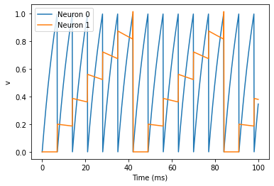
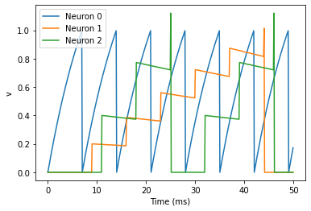
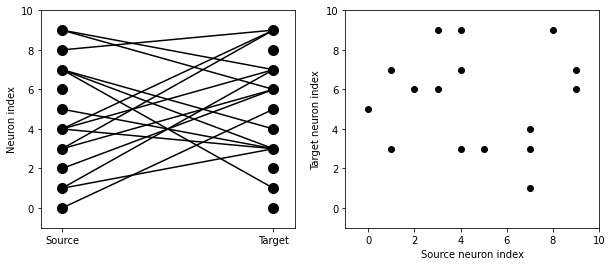
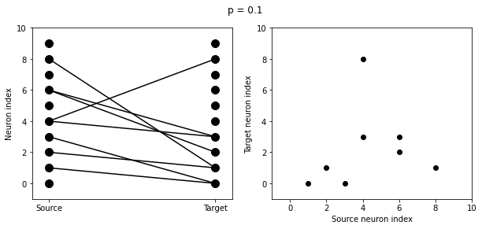
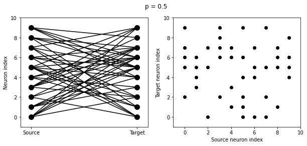
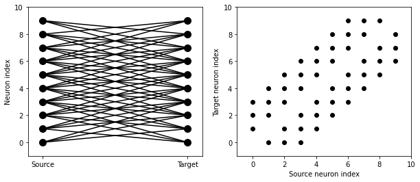
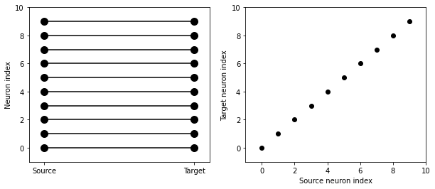
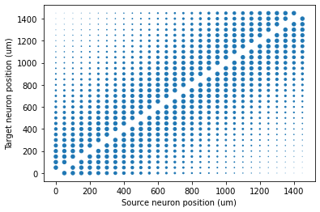
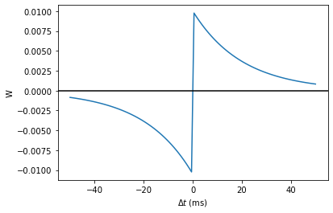

Introduction to Brian part 2: Synapses
======================================

.. only:: html

    .. |launchbinder| image:: http://mybinder.org/badge.svg
    .. _launchbinder: https://mybinder.org/v2/gh/brian-team/brian2-binder/master?filepath=tutorials/2-intro-to-brian-synapses.ipynb

    .. note::
       This tutorial is a static non-editable version. You can launch an
       interactive, editable version without installing any local files
       using the Binder service (although note that at some times this
       may be slow or fail to open): |launchbinder|_

       Alternatively, you can download a copy of the notebook file
       to use locally: :download:`2-intro-to-brian-synapses.ipynb`

       See the :doc:`tutorial overview page <index>` for more details.

If you haven’t yet read part 1: Neurons, go read that now.

As before we start by importing the Brian package and setting up
matplotlib for IPython:

.. code:: ipython3

    from brian2 import *
    %matplotlib inline

The simplest Synapse
--------------------

Once you have some neurons, the next step is to connect them up via
synapses. We’ll start out with doing the simplest possible type of
synapse that causes an instantaneous change in a variable after a spike.

.. code:: ipython3

    start_scope()
    
    eqs = '''
    dv/dt = (I-v)/tau : 1
    I : 1
    tau : second
    '''
    G = NeuronGroup(2, eqs, threshold='v>1', reset='v = 0', method='exact')
    G.I = [2, 0]
    G.tau = [10, 100]*ms
    
    # Comment these two lines out to see what happens without Synapses
    S = Synapses(G, G, on_pre='v_post += 0.2')
    S.connect(i=0, j=1)
    
    M = StateMonitor(G, 'v', record=True)
    
    run(100*ms)
    
    plot(M.t/ms, M.v[0], label='Neuron 0')
    plot(M.t/ms, M.v[1], label='Neuron 1')
    xlabel('Time (ms)')
    ylabel('v')
    legend();

.. parsed-literal::

    <matplotlib.legend.Legend at 0x7fdccb8773d0>

There are a few things going on here. First of all, let’s recap what is
going on with the ``NeuronGroup``. We’ve created two neurons, each of
which has the same differential equation but different values for
parameters I and tau. Neuron 0 has ``I=2`` and ``tau=10*ms`` which means
that is driven to repeatedly spike at a fairly high rate. Neuron 1 has
``I=0`` and ``tau=100*ms`` which means that on its own - without the
synapses - it won’t spike at all (the driving current I is 0). You can
prove this to yourself by commenting out the two lines that define the
synapse.

Next we define the synapses: ``Synapses(source, target, ...)`` means
that we are defining a synaptic model that goes from ``source`` to
``target``. In this case, the source and target are both the same, the
group ``G``. The syntax ``on_pre='v_post += 0.2'`` means that when a
spike occurs in the presynaptic neuron (hence ``on_pre``) it causes an
instantaneous change to happen ``v_post += 0.2``. The ``_post`` means
that the value of ``v`` referred to is the post-synaptic value, and it
is increased by 0.2. So in total, what this model says is that whenever
two neurons in G are connected by a synapse, when the source neuron
fires a spike the target neuron will have its value of ``v`` increased
by 0.2.

However, at this point we have only defined the synapse model, we
haven’t actually created any synapses. The next line
``S.connect(i=0, j=1)`` creates a synapse from neuron 0 to neuron 1.

Adding a weight
---------------

In the previous section, we hard coded the weight of the synapse to be
the value 0.2, but often we would to allow this to be different for
different synapses. We do that by introducing synapse equations.

.. code:: ipython3

    start_scope()
    
    eqs = '''
    dv/dt = (I-v)/tau : 1
    I : 1
    tau : second
    '''
    G = NeuronGroup(3, eqs, threshold='v>1', reset='v = 0', method='exact')
    G.I = [2, 0, 0]
    G.tau = [10, 100, 100]*ms
    
    # Comment these two lines out to see what happens without Synapses
    S = Synapses(G, G, 'w : 1', on_pre='v_post += w')
    S.connect(i=0, j=[1, 2])
    S.w = 'j*0.2'
    
    M = StateMonitor(G, 'v', record=True)
    
    run(50*ms)
    
    plot(M.t/ms, M.v[0], label='Neuron 0')
    plot(M.t/ms, M.v[1], label='Neuron 1')
    plot(M.t/ms, M.v[2], label='Neuron 2')
    xlabel('Time (ms)')
    ylabel('v')
    legend();

.. parsed-literal::

    <matplotlib.legend.Legend at 0x7fdccb7f2750>

This example behaves very similarly to the previous example, but now
there’s a synaptic weight variable ``w``. The string ``'w : 1'`` is an
equation string, precisely the same as for neurons, that defines a
single dimensionless parameter ``w``. We changed the behaviour on a
spike to ``on_pre='v_post += w'`` now, so that each synapse can behave
differently depending on the value of ``w``. To illustrate this, we’ve
made a third neuron which behaves precisely the same as the second
neuron, and connected neuron 0 to both neurons 1 and 2. We’ve also set
the weights via ``S.w = 'j*0.2'``. When ``i`` and ``j`` occur in the
context of synapses, ``i`` refers to the source neuron index, and ``j``
to the target neuron index. So this will give a synaptic connection from
0 to 1 with weight ``0.2=0.2*1`` and from 0 to 2 with weight
``0.4=0.2*2``.

Introducing a delay
-------------------

So far, the synapses have been instantaneous, but we can also make them
act with a certain delay.

.. code:: ipython3

    start_scope()
    
    eqs = '''
    dv/dt = (I-v)/tau : 1
    I : 1
    tau : second
    '''
    G = NeuronGroup(3, eqs, threshold='v>1', reset='v = 0', method='exact')
    G.I = [2, 0, 0]
    G.tau = [10, 100, 100]*ms
    
    S = Synapses(G, G, 'w : 1', on_pre='v_post += w')
    S.connect(i=0, j=[1, 2])
    S.w = 'j*0.2'
    S.delay = 'j*2*ms'
    
    M = StateMonitor(G, 'v', record=True)
    
    run(50*ms)
    
    plot(M.t/ms, M.v[0], label='Neuron 0')
    plot(M.t/ms, M.v[1], label='Neuron 1')
    plot(M.t/ms, M.v[2], label='Neuron 2')
    xlabel('Time (ms)')
    ylabel('v')
    legend();

.. parsed-literal::

    <matplotlib.legend.Legend at 0x7fdccb7f2290>

As you can see, that’s as simple as adding a line ``S.delay = 'j*2*ms'``
so that the synapse from 0 to 1 has a delay of 2 ms, and from 0 to 2 has
a delay of 4 ms.

More complex connectivity
-------------------------

So far, we specified the synaptic connectivity explicitly, but for
larger networks this isn’t usually possible. For that, we usually want
to specify some condition.

.. code:: ipython3

    start_scope()
    
    N = 10
    G = NeuronGroup(N, 'v:1')
    S = Synapses(G, G)
    S.connect(condition='i!=j', p=0.2)

Here we’ve created a dummy neuron group of N neurons and a dummy
synapses model that doens’t actually do anything just to demonstrate the
connectivity. The line ``S.connect(condition='i!=j', p=0.2)`` will
connect all pairs of neurons ``i`` and ``j`` with probability 0.2 as
long as the condition ``i!=j`` holds. So, how can we see that
connectivity? Here’s a little function that will let us visualise it.

.. code:: ipython3

    def visualise_connectivity(S):
        Ns = len(S.source)
        Nt = len(S.target)
        figure(figsize=(10, 4))
        subplot(121)
        plot(zeros(Ns), arange(Ns), 'ok', ms=10)
        plot(ones(Nt), arange(Nt), 'ok', ms=10)
        for i, j in zip(S.i, S.j):
            plot([0, 1], [i, j], '-k')
        xticks([0, 1], ['Source', 'Target'])
        ylabel('Neuron index')
        xlim(-0.1, 1.1)
        ylim(-1, max(Ns, Nt))
        subplot(122)
        plot(S.i, S.j, 'ok')
        xlim(-1, Ns)
        ylim(-1, Nt)
        xlabel('Source neuron index')
        ylabel('Target neuron index')
        
    visualise_connectivity(S)

There are two plots here. On the left hand side, you see a vertical line
of circles indicating source neurons on the left, and a vertical line
indicating target neurons on the right, and a line between two neurons
that have a synapse. On the right hand side is another way of
visualising the same thing. Here each black dot is a synapse, with x
value the source neuron index, and y value the target neuron index.

Let’s see how these figures change as we change the probability of a
connection:

.. code:: ipython3

    start_scope()
    
    N = 10
    G = NeuronGroup(N, 'v:1')
    
    for p in [0.1, 0.5, 1.0]:
        S = Synapses(G, G)
        S.connect(condition='i!=j', p=p)
        visualise_connectivity(S)
        suptitle('p = '+str(p));

.. image:: 2-intro-to-brian-synapses_image_18_2.png

And let’s see what another connectivity condition looks like. This one
will only connect neighbouring neurons.

.. code:: ipython3

    start_scope()
    
    N = 10
    G = NeuronGroup(N, 'v:1')
    
    S = Synapses(G, G)
    S.connect(condition='abs(i-j)<4 and i!=j')
    visualise_connectivity(S)

Try using that cell to see how other connectivity conditions look like.

You can also use the generator syntax to create connections like this
more efficiently. In small examples like this, it doesn’t matter, but
for large numbers of neurons it can be much more efficient to specify
directly which neurons should be connected than to specify just a
condition. Note that the following example uses ``skip_if_invalid`` to
avoid errors at the boundaries (e.g. do not try to connect the neuron
with index 1 to a neuron with index -2).

.. code:: ipython3

    start_scope()
    
    N = 10
    G = NeuronGroup(N, 'v:1')
    
    S = Synapses(G, G)
    S.connect(j='k for k in range(i-3, i+4) if i!=k', skip_if_invalid=True)
    visualise_connectivity(S)

.. image:: 2-intro-to-brian-synapses_image_23_0.png

If each source neuron is connected to precisely one target neuron (which
would be normally used with two separate groups of the same size, not
with identical source and target groups as in this example), there is a
special syntax that is extremely efficient. For example, 1-to-1
connectivity looks like this:

.. code:: ipython3

    start_scope()
    
    N = 10
    G = NeuronGroup(N, 'v:1')
    
    S = Synapses(G, G)
    S.connect(j='i')
    visualise_connectivity(S)

You can also do things like specifying the value of weights with a
string. Let’s see an example where we assign each neuron a spatial
location and have a distance-dependent connectivity function. We
visualise the weight of a synapse by the size of the marker.

.. code:: ipython3

    start_scope()
    
    N = 30
    neuron_spacing = 50*umetre
    width = N/4.0*neuron_spacing
    
    # Neuron has one variable x, its position
    G = NeuronGroup(N, 'x : metre')
    G.x = 'i*neuron_spacing'
    
    # All synapses are connected (excluding self-connections)
    S = Synapses(G, G, 'w : 1')
    S.connect(condition='i!=j')
    # Weight varies with distance
    S.w = 'exp(-(x_pre-x_post)**2/(2*width**2))'
    
    scatter(S.x_pre/um, S.x_post/um, S.w*20)
    xlabel('Source neuron position (um)')
    ylabel('Target neuron position (um)');

.. parsed-literal::

    Text(0, 0.5, 'Target neuron position (um)')

Now try changing that function and seeing how the plot changes.

More complex synapse models: STDP
---------------------------------

Brian’s synapse framework is very general and can do things like
short-term plasticity (STP) or spike-timing dependent plasticity (STDP).
Let’s see how that works for STDP.

STDP is normally defined by an equation something like this:

.. math:: \Delta w = \sum_{t_{pre}} \sum_{t_{post}} W(t_{post}-t_{pre})

That is, the change in synaptic weight w is the sum over all presynaptic
spike times :math:`t_{pre}` and postsynaptic spike times
:math:`t_{post}` of some function :math:`W` of the difference in these
spike times. A commonly used function :math:`W` is:

.. math::

   W(\Delta t) = \begin{cases}
   A_{pre} e^{-\Delta t/\tau_{pre}} & \Delta t>0 \\
   A_{post} e^{\Delta t/\tau_{post}} & \Delta t<0
   \end{cases}

This function looks like this:

.. code:: ipython3

    tau_pre = tau_post = 20*ms
    A_pre = 0.01
    A_post = -A_pre*1.05
    delta_t = linspace(-50, 50, 100)*ms
    W = where(delta_t>0, A_pre*exp(-delta_t/tau_pre), A_post*exp(delta_t/tau_post))
    plot(delta_t/ms, W)
    xlabel(r'$\Delta t$ (ms)')
    ylabel('W')
    axhline(0, ls='-', c='k');

.. parsed-literal::

    <matplotlib.lines.Line2D at 0x7fdccb5acdd0>

Simulating it directly using this equation though would be very
inefficient, because we would have to sum over all pairs of spikes. That
would also be physiologically unrealistic because the neuron cannot
remember all its previous spike times. It turns out there is a more
efficient and physiologically more plausible way to get the same effect.

We define two new variables :math:`a_{pre}` and :math:`a_{post}` which
are “traces” of pre- and post-synaptic activity, governed by the
differential equations:

.. math::

   \begin{aligned}
   \tau_{pre}\frac{\mathrm{d}}{\mathrm{d}t} a_{pre} &= -a_{pre}\\
   \tau_{post}\frac{\mathrm{d}}{\mathrm{d}t} a_{post} &= -a_{post}
   \end{aligned}

When a presynaptic spike occurs, the presynaptic trace is updated and
the weight is modified according to the rule:

.. math::

   \begin{aligned}
   a_{pre} &\rightarrow a_{pre}+A_{pre}\\
   w &\rightarrow w+a_{post}
   \end{aligned}

When a postsynaptic spike occurs:

.. math::

   \begin{aligned}
   a_{post} &\rightarrow a_{post}+A_{post}\\
   w &\rightarrow w+a_{pre}
   \end{aligned}

To see that this formulation is equivalent, you just have to check that
the equations sum linearly, and consider two cases: what happens if the
presynaptic spike occurs before the postsynaptic spike, and vice versa.
Try drawing a picture of it.

Now that we have a formulation that relies only on differential
equations and spike events, we can turn that into Brian code.

.. code:: ipython3

    start_scope()
    
    taupre = taupost = 20*ms
    wmax = 0.01
    Apre = 0.01
    Apost = -Apre*taupre/taupost*1.05
    
    G = NeuronGroup(1, 'v:1', threshold='v>1', reset='')
    
    S = Synapses(G, G,
                 '''
                 w : 1
                 dapre/dt = -apre/taupre : 1 (event-driven)
                 dapost/dt = -apost/taupost : 1 (event-driven)
                 ''',
                 on_pre='''
                 v_post += w
                 apre += Apre
                 w = clip(w+apost, 0, wmax)
                 ''',
                 on_post='''
                 apost += Apost
                 w = clip(w+apre, 0, wmax)
                 ''')

There are a few things to see there. Firstly, when defining the synapses
we’ve given a more complicated multi-line string defining three synaptic
variables (``w``, ``apre`` and ``apost``). We’ve also got a new bit of
syntax there, ``(event-driven)`` after the definitions of ``apre`` and
``apost``. What this means is that although these two variables evolve
continuously over time, Brian should only update them at the time of an
event (a spike). This is because we don’t need the values of ``apre``
and ``apost`` except at spike times, and it is more efficient to only
update them when needed.

Next we have a ``on_pre=...`` argument. The first line is
``v_post += w``: this is the line that actually applies the synaptic
weight to the target neuron. The second line is ``apre += Apre`` which
encodes the rule above. In the third line, we’re also encoding the rule
above but we’ve added one extra feature: we’ve clamped the synaptic
weights between a minimum of 0 and a maximum of ``wmax`` so that the
weights can’t get too large or negative. The function
``clip(x, low, high)`` does this.

Finally, we have a ``on_post=...`` argument. This gives the statements
to calculate when a post-synaptic neuron fires. Note that we do not
modify ``v`` in this case, only the synaptic variables.

Now let’s see how all the variables behave when a presynaptic spike
arrives some time before a postsynaptic spike.

.. code:: ipython3

    start_scope()
    
    taupre = taupost = 20*ms
    wmax = 0.01
    Apre = 0.01
    Apost = -Apre*taupre/taupost*1.05
    
    G = NeuronGroup(2, 'v:1', threshold='t>(1+i)*10*ms', refractory=100*ms)
    
    S = Synapses(G, G,
                 '''
                 w : 1
                 dapre/dt = -apre/taupre : 1 (clock-driven)
                 dapost/dt = -apost/taupost : 1 (clock-driven)
                 ''',
                 on_pre='''
                 v_post += w
                 apre += Apre
                 w = clip(w+apost, 0, wmax)
                 ''',
                 on_post='''
                 apost += Apost
                 w = clip(w+apre, 0, wmax)
                 ''', method='linear')
    S.connect(i=0, j=1)
    M = StateMonitor(S, ['w', 'apre', 'apost'], record=True)
    
    run(30*ms)
    
    figure(figsize=(4, 8))
    subplot(211)
    plot(M.t/ms, M.apre[0], label='apre')
    plot(M.t/ms, M.apost[0], label='apost')
    legend()
    subplot(212)
    plot(M.t/ms, M.w[0], label='w')
    legend(loc='best')
    xlabel('Time (ms)');

.. parsed-literal::

    Text(0.5, 0, 'Time (ms)')

.. image:: 2-intro-to-brian-synapses_image_33_1.png

A couple of things to note here. First of all, we’ve used a trick to
make neuron 0 fire a spike at time 10 ms, and neuron 1 at time 20 ms.
Can you see how that works?

Secondly, we’ve replaced the ``(event-driven)`` by ``(clock-driven)`` so
you can see how ``apre`` and ``apost`` evolve over time. Try reverting
this change and see what happens.

Try changing the times of the spikes to see what happens.

Finally, let’s verify that this formulation is equivalent to the
original one.

.. code:: ipython3

    start_scope()
    
    taupre = taupost = 20*ms
    Apre = 0.01
    Apost = -Apre*taupre/taupost*1.05
    tmax = 50*ms
    N = 100
    
    # Presynaptic neurons G spike at times from 0 to tmax
    # Postsynaptic neurons G spike at times from tmax to 0
    # So difference in spike times will vary from -tmax to +tmax
    G = NeuronGroup(N, 'tspike:second', threshold='t>tspike', refractory=100*ms)
    H = NeuronGroup(N, 'tspike:second', threshold='t>tspike', refractory=100*ms)
    G.tspike = 'i*tmax/(N-1)'
    H.tspike = '(N-1-i)*tmax/(N-1)'
    
    S = Synapses(G, H,
                 '''
                 w : 1
                 dapre/dt = -apre/taupre : 1 (event-driven)
                 dapost/dt = -apost/taupost : 1 (event-driven)
                 ''',
                 on_pre='''
                 apre += Apre
                 w = w+apost
                 ''',
                 on_post='''
                 apost += Apost
                 w = w+apre
                 ''')
    S.connect(j='i')
    
    run(tmax+1*ms)
    
    plot((H.tspike-G.tspike)/ms, S.w)
    xlabel(r'$\Delta t$ (ms)')
    ylabel(r'$\Delta w$')
    axhline(0, ls='-', c='k');

.. parsed-literal::

    <matplotlib.lines.Line2D at 0x7fdcc8ae8890>

Can you see how this works?

End of tutorial
---------------
